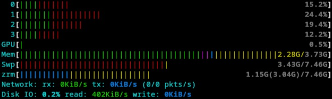
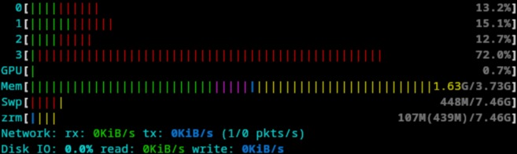
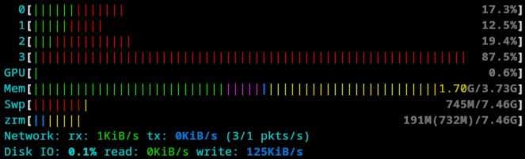
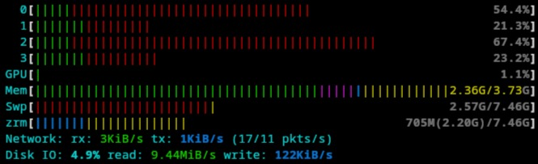

# Swap on ZRAM

The [ZRAM](https://github.com/torvalds/linux/tree/master/drivers/block/zram) Linux kernel module is capable of creating compressed ram disks. Since being block devices they can be formatted with any filesystem. Fedora uses [Swap on ZRAM](https://fedoraproject.org/wiki/Changes/SwapOnZRAM) by default on all Spins.

There exist several packages to configure compressed ZRAM drives and some are conveniently setting one up as swap. Fedora uses the [systemd-zram-generator](https://github.com/systemd/zram-generator) via its `zram-generator-defaults` package. Starting with v1.2.1 it supports (via https://github.com/systemd/zram-generator/issues/178 and https://github.com/systemd/zram-generator/pull/200) the configuration of secondary compression algorithms to recompress pages on a ZRAM drive. Furthermore ZRAM requires recompression to be triggered by touching a knob in sysfs, which is out of scope of the project.

It is important to know that in ZRAM terms _incompressible_ (e.g. with one compression algorithm but not necessarily with another) pages are called `huge`; Linux's Memory Management subsystem also has a concept of [`huge pages`](https://docs.kernel.org/admin-guide/mm/concepts.html#huge-pages) but means something entirely different. On top of that marking pages as `idle` requires memory tracking which Fedora / Bazzite currently deactivates in production kernels. The actual implementation neither relies on either huge or idle pages.

## Implementation

The Linux Memory Mangement subsystem has been heavily tilted in [20-zram-swap.conf](files/system/etc/sysctl.d/20-zram-swap.conf) for swapping out pages by setting `swappiness=180` and the swap's page readahead was deactivated by setting `page_cluster=0` to improve random IOPS with the cost of more page faults. Some synthetic benchmarks (see links below) measured ~2M IOPS with `lz4` and ~820k IOPS with `zstd1`. Other values were essentially collected from the Arch Linux documentation and some blog posts I've also linked below.

Therefore ZRAM is configured in [zram-generator.conf](files/system/etc/systemd/zram-generator.conf) to use `lz4` as a fast, low-latency compression algorithm and `zstd1` as secondary one. The system will try to recompress some amount of pages once every few seconds. The exact amount of pages is scaled with the system's resources, depending on the total system memory per CPU core as a simple metric.

To actually facilitate recompression it uses a [zram-recompression.timer](files/system/etc/systemd/system/zram-recompression.timer) to orchestrate the one-off execution of a [zram-recompression.service](files/system/etc/systemd/system/zram-recompression.service). Since freed memory is likely to become fragmented over time another set of systemd units, a [zram-compaction.service](files/system/etc/systemd/system/zram-compaction.service) and a [zram-compaction.timer](files/system/etc/systemd/system/zram-compaction.timer) have been created. The Service units are configured to trigger either compaction for all existing ZRAM devices or recompression for the ZRAM swap drive. Timers add a randomized delay of up to 10% to the cycle time.

## Outcome

On an old device with less than 4 GiB of system memory, I've observed that the ZRAM swap converged from a ratio of minimum 2:1 to ratios of roughly 3:1 during "normal" and up to 4:1 during certain excessive usage scenarios (Browser, several Electron shells e.g. for code editing + communication, E-Mail, password databases, office application(s), file synchronization application(s), screen capture, image manipulation, ...) while the system stays _mostly_ reactive, as much as one can expect from this outdated machine. With this configuration I try to achieve an amenable user experience, but the capabilities of my system are still limited. At the very least it is more fun and less frustrating to work with than ever before. ;c)

### Just LZ4 and no recompression under heavier usage

### Using zstd:1 as recompression algorightm, from light to heavy usage

## Improvements

Regularly trying to recompress some fixed number of pages may not be sufficient. One next step could be to enable [memory tracking](https://docs.kernel.org/admin-guide/blockdev/zram.html#memory-tracking) which allows to set a duration after which an unused page would be marked as idle. Recompression could thus be limited to such idle pages which were swapped out for a time, limiting the chance to recompress pages which are going to be evicted qickly. More compression algorithms and levels could be added as well to account for remaining huge (=incompressible) pages, subsequently using `zstd3` or `lz4hc`, for instance.

## Blogs

- [Free vs. Available Memory in Linux; August 30, 2024 by Hayden James, in Blog Linux](https://linuxblog.io/free-vs-available-memory-in-linux/)
- [Linux Performance: Almost Always Add Swap Space – Part 2: ZRAM; September 25, 2023 by Hayden James, in Blog Linux](https://haydenjames.io/linux-performance-almost-always-add-swap-part2-zram/)
- [Tales from responsivenessland: why Linux feels slow, and how to fix that](https://rudd-o.com/linux-and-free-software/tales-from-responsivenessland-why-linux-feels-slow-and-how-to-fix-that)
- [Tuning ZRAM in Fedora for Better Performance and Get Rid of OOM Crashes; Tue, Dec 12, 2023](https://blog.guillaumea.fr/post/tuning_zram_fedora_for_better_performance/)

## Documentation

- [Virtual Memory](https://www.kernel.org/doc/html/latest/admin-guide/sysctl/vm.html)
- [zram: Compressed RAM-based block devices](https://docs.kernel.org/admin-guide/blockdev/zram.html)
- [Phoronix Test Suite](https://github.com/phoronix-test-suite/phoronix-test-suite/blob/master/documentation/phoronix-test-suite.md)
- [OpenBenchmarking](https://openbenchmarking.org/features)

## Github

- [Zram can be configured more optimally by using lz4 instead of zstd1 #1570](https://github.com/ublue-os/bazzite/issues/1570)
- [fix: General ZRAM Optimizations #2202](https://github.com/ublue-os/bazzite/pull/2202)

## Wikis

- [Arch Wiki - Zram](https://wiki.archlinux.org/title/Zram)
- [Fedora Wiki - Changes/Scale ZRAM to full memory size](https://fedoraproject.org/wiki/Changes/Scale_ZRAM_to_full_memory_size)
- [Fedora Wiki - Changes/Swap on ZRAM](https://fedoraproject.org/wiki/Changes/SwapOnZRAM)
